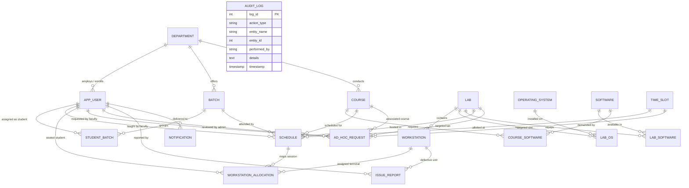

# Automatic Lab Allocation System — Database Design Document

## 1. System Overview & Problem Statement
Traditional academic laboratory scheduling relies heavily on manual coordination and static spreadsheets. This leads to frequent room double-bookings, faculty schedule overlaps, untracked workstation hardware faults, and poor lab utilization. 

The **Automatic Lab Allocation System** resolves these challenges by enforcing relational integrity and conflict detection directly within **MySQL 8.0** at the database layer. Even under high concurrency, ACID transactions, table unique constraints, check constraints, and active triggers prevent double-bookings and race conditions.

---

## 2. Entity-Relationship (ER) Diagram

---

## 3. Relational Schema & Table Specifications

| Table Name | Primary Key | Foreign Keys | Key Constraints & Invariants |
| :--- | :--- | :--- | :--- |
| `department` | `dept_id` | *None* | `dept_name` UNIQUE |
| `app_user` | `user_id` | `dept_id` &rarr; `department(dept_id)` | `email` UNIQUE, `role` ENUM('ADMIN','FACULTY','STUDENT') |
| `batch` | `batch_id` | `dept_id` &rarr; `department(dept_id)` | `UNIQUE(dept_id, batch_name)` |
| `student_batch` | `student_id` | `student_id` &rarr; `app_user`, `batch_id` &rarr; `batch` | 1-to-N student partition into academic batches |
| `course` | `course_id` | `dept_id` &rarr; `department(dept_id)` | `course_code` UNIQUE |
| `lab` | `lab_id` | *None* | `lab_name` UNIQUE, `CHECK(capacity > 0)`, `CHECK(gpu_capacity >= 0)` |
| `operating_system`| `os_id` | *None* | `os_name` UNIQUE |
| `lab_os` | `(lab_id, os_id)` | `lab_id` &rarr; `lab`, `os_id` &rarr; `operating_system` | Multi-valued OS decomposed for 1NF |
| `software` | `software_id`| *None* | `software_name` UNIQUE |
| `lab_software` | `(lab_id, software_id)` | `lab_id` &rarr; `lab`, `software_id` &rarr; `software` | Multi-valued Software decomposed for 1NF |
| `course_software`| `(course_id, software_id)` | `course_id` &rarr; `course`, `software_id` &rarr; `software` | Course software requirements |
| `workstation` | `workstation_id` | `lab_id` &rarr; `lab` | `UNIQUE(lab_id, station_number)`, `status` ENUM |
| `time_slot` | `slot_id` | *None* | `UNIQUE(day_of_week, start_time, end_time)`, `CHECK(end_time > start_time)` |
| `schedule` | `schedule_id`| `course_id`, `faculty_id`, `lab_id`, `slot_id`, `batch_id` | **`UNIQUE(lab_id, slot_id)`** (No lab double booking) **`UNIQUE(faculty_id, slot_id)`** (No faculty clash) **`UNIQUE(batch_id, slot_id)`** (No batch clash) |
| `workstation_allocation` | `(schedule_id, student_id)` | `schedule_id` &rarr; `schedule`, `student_id` &rarr; `app_user`, `workstation_id` &rarr; `workstation` | **`UNIQUE(schedule_id, workstation_id)`** (Single student per seat per lab session) |
| `ad_hoc_request` | `request_id` | `faculty_id`, `lab_id`, `slot_id`, `course_id`, `reviewed_by` | `status` ENUM, Validated by procedure & trigger |
| `issue_report` | `issue_id` | `reported_by` &rarr; `app_user`, `workstation_id` &rarr; `workstation` | Real-time workstation fault reporting |
| `notification` | `notification_id` | `user_id` &rarr; `app_user` | Push notification alerts for timetable shifts |
| `audit_log` | `log_id` | *None* | Automated append-only audit trail fired by triggers |

---

## 4. Normalization Justification (1NF &rarr; 2NF &rarr; 3NF)

### 1NF (First Normal Form)
- **Criterion**: Every table attribute contains only atomic (indivisible) scalar values; no repeating groups or comma-separated lists.
- **Application**: In legacy designs, `lab.os_installed` and `lab.software` were stored as comma-delimited strings (e.g. `'Ubuntu, Windows'` or `'Python, MySQL'`). In this design, they are normalized into separate relation entities (`operating_system`, `software`) and resolved via bridge tables (`lab_os`, `lab_software`, `course_software`).

### 2NF (Second Normal Form)
- **Criterion**: Must be in 1NF and have NO partial dependencies (every non-key attribute must be fully functionally dependent on the entire composite primary key).
- **Application**: In composite associative tables like `lab_software(lab_id, software_id)` and `course_software(course_id, software_id)`, there are zero non-key descriptive attributes that depend solely on `lab_id` or `course_id`. Similarly, in `workstation_allocation(schedule_id, student_id)`, attributes such as `student_name` are kept in `app_user`, preventing partial dependencies.

### 3NF (Third Normal Form)
- **Criterion**: Must be in 2NF and have NO transitive dependencies (non-prime attributes must depend directly and ONLY on the candidate key, $X \to Y$ where $Y$ is not dependent on another non-key attribute $Z$).
- **Application**: 
  - `department_name` is stored only in `department`, not replicated in `app_user`, `batch`, or `course`.
  - In `lab`, `system_count` was omitted because it is a transitive aggregate derivable via `COUNT(workstation)` on `workstation.lab_id`. Storing it would introduce update anomalies if a workstation is added or removed.
  - In `schedule`, faculty names, lab capacities, and time slots are referenced exclusively via foreign keys (`faculty_id`, `lab_id`, `slot_id`), eliminating transitive data anomalies.

---

## 5. DBMS Concepts Implemented & Showcase Mapping

| DBMS Concept | Implementation Location | Viva Explanation / Demonstration |
| :--- | :--- | :--- |
| **Integrity Constraints** | `schema.sql` (`schedule`, `time_slot`, `lab`) | `UNIQUE(lab_id, slot_id)` prevents spatial conflict; `CHECK(end_time > start_time)` and `CHECK(capacity > 0)` enforce domain integrity. |
| **Cascading & Restrict FKs** | `schema.sql` | `ON DELETE CASCADE` cleans dependent allocations on schedule drop; `ON DELETE RESTRICT` protects courses/labs active in master schedule. |
| **Database Views** | `dbms_features.sql` (`vw_student_timetable`, `vw_master_schedule`, `vw_lab_utilization`, `vw_lab_health_status`) | Virtual tables abstracting multi-table joins and calculating real-time utilization % and workstation health. |
| **ACID Transactions** | `sp_approve_ad_hoc_request`, `sp_allocate_student_seats` | `START TRANSACTION`, `SELECT ... FOR UPDATE` row locks, and `COMMIT`/`ROLLBACK` with `SQLEXCEPTION` handlers ensure strict isolation and zero dirty writes. |
| **Stored Procedures** | `sp_approve_ad_hoc_request`, `sp_allocate_student_seats`, `sp_book_ad_hoc_slot` | Encapsulate multi-step business logic and seat-allocation algorithms on the database server. |
| **User-Defined Functions** | `fn_check_lab_availability`, `fn_get_lab_utilization_pct` | Scalar deterministic routines for modular availability checks and utilization metric calculations. |
| **Database Triggers** | `trg_adhoc_before_approve`, `trg_schedule_after_insert_audit`, `trg_issue_after_insert_workstation` | `BEFORE UPDATE` raises custom `SIGNAL` on timetable conflict; `AFTER INSERT` maintains asynchronous audit logging and updates hardware status to `FAULTY`. |
| **Relational Division** | Query Showcase Q4 (`course_software` vs `lab_software`) | Double `NOT EXISTS` query identifying labs providing 100% of the software tools mandated by a curriculum. |
| **Subqueries & Aggregations** | Query Showcase Q5, Q6, Q8 | `GROUP BY ... HAVING COUNT(*) > (SELECT AVG(...))` finding above-average lab utilization and faculty workloads. |
| **B-Tree Indexing** | `schema.sql` (`idx_schedule_faculty`, `idx_adhoc_lookup`, etc.) | Composite and foreign key indexes accelerating join traversals and fast calendar filtering. |
